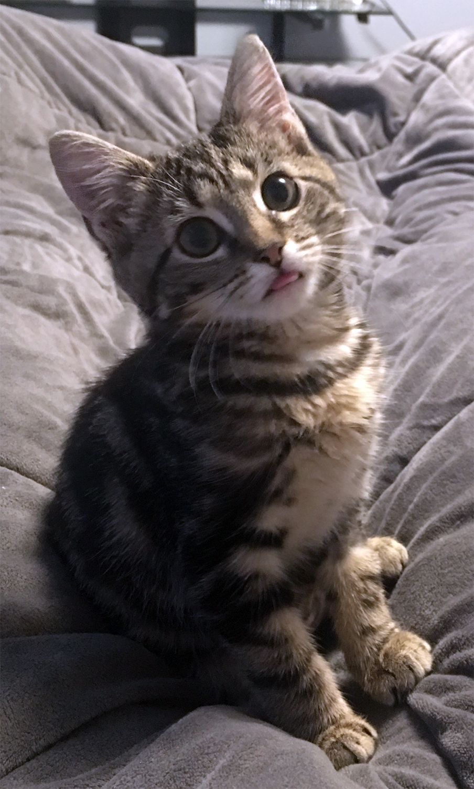

# StudyCat

 > _Note:_ This document is meant to evolve throughout the planning phase of your project.    
 > That is, it makes sense for you commit regularly to this file while working on the project (especially edits/additions/deletions to the _Highlights_ section).

#### Q1: What are you planning to build?

An app to help increase productivity by gamifying productive work. The idea is that you raise a cartoon cat, based on how much productivity you do. We will categorize programs and websites as productive or unproductive. The more you use or visit something categorized as unproductive, the cat will lose affection for you and become sad. On the other hand when there is a lot of productive work done, the reward will be the increased affection and happiness of the cat. 

#### Q2: Who are your target users?

The target user would be anyone who wants to be productive with their at their computer and would benefit from having a fun way to help track of their productivity. (i.e. Students, office workers). 

#### Q3: Why would your users choose your product? What are they using today to solve their problem/need?

The product gets instant feedback in a "cute" way so the cat will feel an emotional drive to keep the cat healthy.
This would also attract people who love playing video games as it would "gamify" productivity.
Currently there are a lot of apps geared towards improving productivity, which range from todo lists to full fledged games. One such application is RescueTime, which tracks how much time is spent using productive / unproductive programs and gives a "productivity pulse" which is a rating out of 100. 
Possible Expansion: Allow for teams to raise a cat which will have different levels of affection to each team member depending on how much work they have done.

----

### Highlights

- We went through different iterations of our original idea.
- For each idea, we identified potential problems and ideas which have already been implemented, which allowed us to eliminate majority of the ideas on our list.
- We finally decided to "gamify" our productivity idea that we had earlier and
think that it would be a fun project to do since most of us like playing games
and find it difficult to stay productive. So there would be a target audience for it.

----
