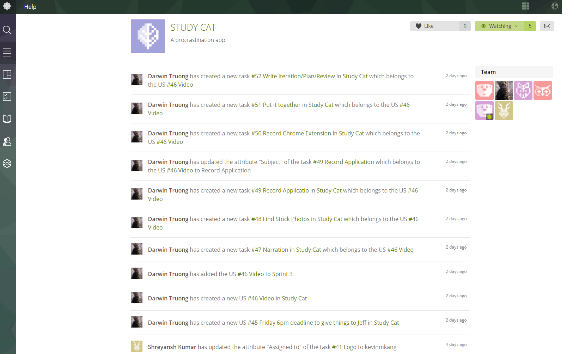
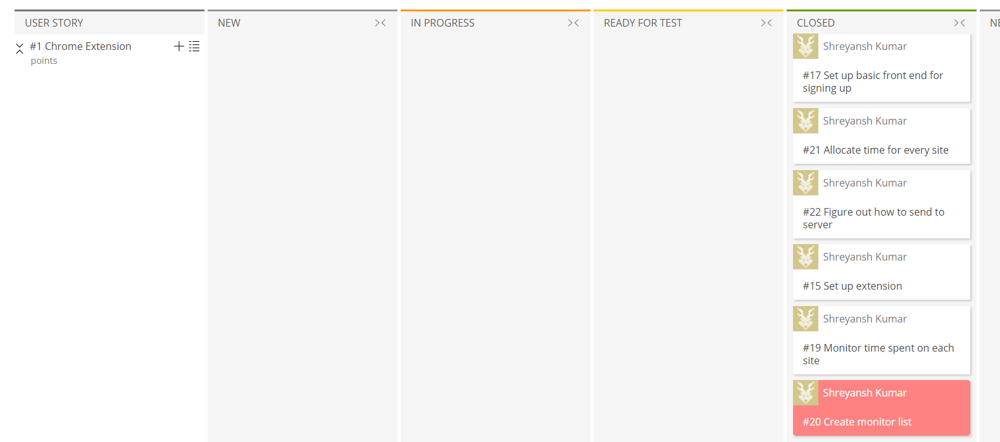
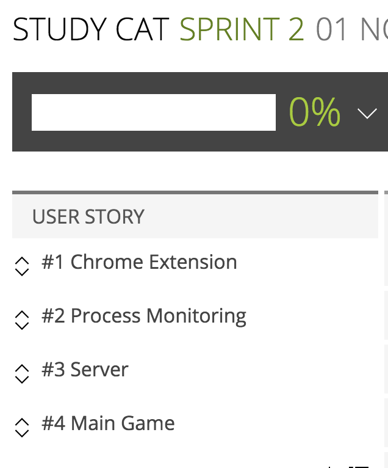
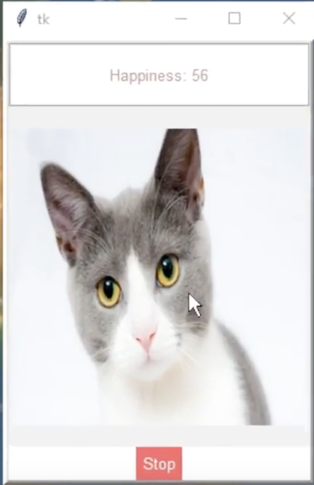
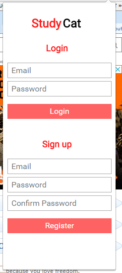

# Study Cat

## Iteration 2 - Review & Retrospect

When: Thursday November 16
Where: Online via. Discord

## Process - Reflection

#### Decisions that turned out well

* Splitting into 3 teams for each portion of the app (Server team, Desktop Client, Chrome Extension).
    - This allowed us to break the project down into it's natural components, where each team could focus on a specific part.
    - Each team had it's own Taiga section (more on that in the second point), where each member could see the current status of various tasks that would be assigned.
* Using Taiga.io to manage team tasks.
    - This allowed us to break the project down even more into small managable tasks, for example for the desktop client, we broke it down further into process monitoring, UI, and client-server interactions. Allowing for much more organized development. 
    - It also let us mark the status of each task, i.e completed, needs more info, in progress, etc. Which also

 \
[Link to some of our team notes.](https://drive.google.com/drive/folders/0B2HiDj_0mhzYZktXVWxpaUdUZW8)

#### Decisions that did not turn out as well as hoped

* Data persistence is not where we wanted it to be by this stage
    - We originally wanted to have user data persist throughout sessions on multiple devices, but we ran into some technical issues, such as the client and server not communicating the way we wanted it to and spending too much time trying to get user authentication to work over the actual database functionality

#### Planned Changes

* Changing from a single-platform process monitor to a interface that allows support for multiple operating systems
    - We believe that it is important to support multiple operating systems since even during development we ran into issues with not being able to run the app on Unix based systems.
    - Considering that a significant portion of people are not exclusively using Windows, we would be losing a lot of potential users by restricting the type of operating system
* UI improvements
    - The current state of the UI is very barebones and simple, a future change that we are planning is to style and redesign the UI
    - This includes having proper cat artwork, and smoother user input design (buttons, text input, etc.)
    - The app will be more appealing if the visuals are improved
* Group Functionality
    - We plan on adding a feature that allows for multiple users to join a group where each user will have a certain score, therefore incentivizing the group members to be more productive.
    - This unique feature will make our app stand out compared to other productivity apps
 
## Product - Review

#### Goals and/or tasks that were met/completed:

* Getting the main process monitoring and productivity score algorithm up at working
* Server that uses Firebase for user authentication
* Having a Chrome extension to monitor active browser tabs

#### Goals and/or tasks that were planned but not met/completed:

* Having the User's data persist across devices
    - Synchronizing data between devices hasn't been implemented yet
    - The team determined that getting the main functionality as good as possible was a higher priority than extra details such as multi device support
* Multi-platform support (OSX and W10)
    - Currently the process monitoring will only work for devices using Windows as we installed the win32 packages instead of the Unix based packages
    - We plan on creating an interface which will allow the app to dynamically choose which packages to use for process monitoring. 

## Meeting Highlights

* For our next iteration we are planning on implementing the goals that we planned earlier but were not able to complete such as user data persistence, and multi-platform support. We believe that these are important features that should be implemeneted for our MVP, which we explain above.
* For the MVP we also want to have group functionality implemented, as this was one of the key unique features of our app.
* We also plan on adding some smaller features such as being able to customize appearance of the cat/user and adding custom user-defined productivity levels (being able create our own productivity categories).