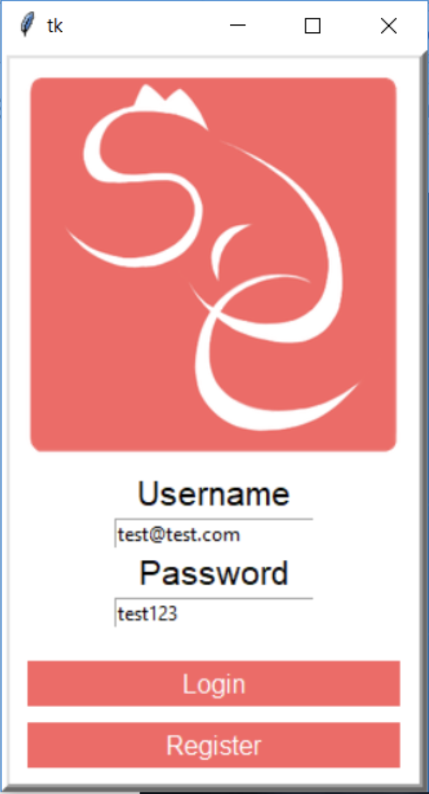
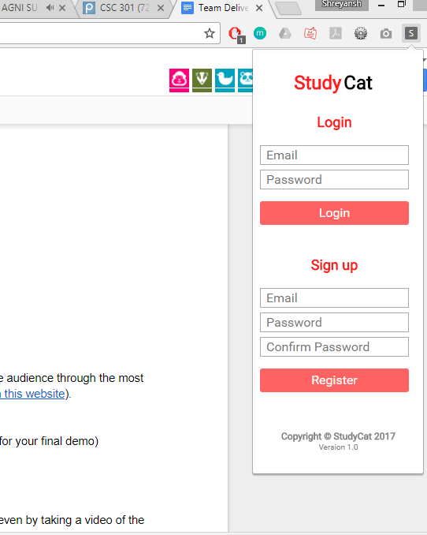

# Study Cat

 > _Note:_ This document is meant to be written during (or shortly after) your initial planning meeting.     
 > It does not really make sense for you to edit this document much (if at all) while working on the project - Instead, at the end of the planning phase, you can refer back to this document and decide which parts of your plan you are happy with and which parts you would like to change.

## Iteration 3

 * Start date:November 17th, 2017
 * End date: December 1st, 2017

## Process

#### Changes from previous iteration

List the most significant changes you made to your process (if any).

 * At most 3 items
 * Start with the most significant change
 * For each change, explain why you are making it and what you are hoping to achieve from it
 * Ideally, for each change, you will define a clear success metric (i.e. something you can measure at the end of the iteration to determine whether the change you made was successful)

 > *Note:* If you are not making any changes to your process, it means that you are happy with all of the decisions you made in the previous iterations.
 > In this case, list what you consider to be the most significant process decisions your team made. For each decision, explain why you consider it successful, and what success metric you are using (or could use) to assert that the decision is successful.

1. Github Workflow

The Github Workflow we used was very important to the success of our project. There were three main reasons for this:

- First, it allowed other groups to easily create test doubles in order to test their section of the code. Since each portion was in their own branches, there was no risk of current changes affecting other members working on the code base.
- Secondly, this allows us to always have our current versions of the current product on the master branch. This allows us to not allow last minute changes to the product to ruin things for the tutorial/demo, and to easily discard changes.
- Finally, this was a very easy way to prevent overall merge conflicts. Since each person had their own branch on their own section of the codebase, slightly modifying files for testing became very easy.

Some success metrics we used is the number of merge conflicts we got as well as the number of times for which we were blocked from testing as a result of other people's code. It was clear that due to our Github workflow, none of these things happened.

2. Taiga.io

We are very proud of our decision to use Taiga throughout this project because we believed that it was better than any other alternative we found. The main reason we choose Taiga was because it allowed us to add user stories which made it easy for each team to co-ordinate task allocation especially since we had different teams working on different parts of the app. This was something which both Trello and Github didn't have. We did originally try both Trello and Github workflow because of number of tasks that were mis-managed/not co-ordinated well (our metric), we realized that there were better alternatives. 

#### Roles & responsibilities

Describe the different roles on the team and the responsibilities associated with each role.

First, we divided into three main teams:

<b>Team 1 (Main Application) </b>: 

Kevin Kang

- Responsible for process monitoring
- UI design of front end

Kevin Zheng

- Implement asynchronous functionality for server callbacks

<b>Team 2 (Extension) </b>: 

Shrey Kumar

- Move blacklist functionality to another page
- Complete chrome extension front end and back end

<b>Team 3 (Android App) </b>:

Darwin Truong

- Login
- Notification background service for constant cat data

Jeff Lin

- Work on main GUI of the android application

Hongyu Wang

- Work on asynchronous server callbacks for android callbacks

#### Events

Describe meetings (and other events) you are planning to have:

 * When and where? In-person or online?

 We are planning to have meetings online once per week on Sunday.

 * What's the purpose of each meeting?

    - You state the current progress you have on your portion of the code, if there are any problems with your portion.
    - Reassign and redistrubute new tasks that come up
    
Monday evening meetings directly after tutorial are held to determine tasks for the next week. The group facilitates discussion to focus on our goals for the application as a whole - sample questions being "what's the most important thing for the next week", or questions about the infrastructure of our application and how each team's products should communicate with the other (i.e, local server vs one online server.)
They will be held directly after tutorial meetings so that the feedback from the TA is fresh in our minds, so we can incorporate it into our goals for the next sprint.

Thursday meetings act as a mid-week checkup. Everyone will give an update on the work they've done so far during the week, and then we'll revise our tasks as seen (if some tasks are seen to be harder than others, or require more manpower), or reallocate people to different tasks to make sure it's going to be done.
These meetings will be shorter than the other two for the most part; they serve mainly to update the group on progress, and less so about the overall structure of the app.

Sunday meetings will act as a buffer to the tutorial; tasks are expected to be completed by this time, and everyone will report what's been done and we'll figure out our strategy for the tutorial - mainly what we'll talk about, and what we'll present. As well, since all tasks are complete, another group discussion is held to figure out possible tasks for the next week, and based on the progress/ difficulty of the tasks completed, to re-prioritize the most important part of the app, and whether certain tasks were worth the effort or not.

For the most part, the meeting plan will stay the same as previous sessions. We found it quite productive, and it was a good process to continue on with. Mid week checks along with cumulative and meaningful end of week meetings allowed us to meet our deadlines and understand our goals for the next week. For this last iteration we will host a more meetings between our standard 3 in preparation for the tutorial, deliverable 3, and the final demo, to discuss our game plan and specifics. It will be necessary to reconvene and reconfirm details/ discuss our goals more and more as the final demo is approaching.

 * Other events could be coding sessions, code reviews, quick weekly sync' meeting online, etc.
     - Coding sessions are to be done throughout the week by several individuals.

List/describe the artifacts you will produce in order to organize your team.       

 * Artifacts can be To-do lists, Task boards, schedule(s), etc.
 * We want to understand:
   * How do you keep track of what needs to get done?
   * How do you prioritize tasks?
   * How do tasks get assigned to team members?

The main artifact we will produce is Taiga.io. Sprints will be created either weekly or bi-weekly (depending on both our availability), and four user stories will be used to organize tasks (based on the teams, as well): Chrome Extension, Process Monitoring, Server, and Main Game. Each of these represents one of the four main core aspects of our app.
Tasks are prioritized based on how important they are to the basic functionality of the app (the MVP). For the most part, this will be the most basic process monitoring, hooked up to a user system and with the chrome extension feeding information in to the desktop app, and all of this affecting the cat's affection.
Generally, since tasks will be formulated during the Monday meetings, we will as a group discuss the most important tasks for the week (across teams as well, since each team relies on eachother for full app functionality.) Everyone will then decide which task they want to take, and once all tasks are allocated, we re-meet on the Thursday.

Again, the process will stay the same, with some minor additions. The process continues to be successful - Taiga tracks our progress and or tasks, while Github actually hosts our code and gives us visual feedback on contributions and the codebase. Google Drive was also added to the mix moreso than last deliverables in order to host meeting minutes and other potentially important files (such as video demo related planning, or other note taking / idea jotting related to the game and infrastructure of our project).

#### Git / GitHub workflow

Describe your Git / GitHub workflow.     
Essentially, we want to understand how your team members share a codebase and avoid conflicts.

 * Be concise, yet precise.      
For example, "we use pull-requests" is not a precise statement since it leaves too many open questions - Pull-requests from where to where? Who reviews the pull-requests? Who is responsible for merging them? etc.
 * If applicable, specify any naming conventions or standards you decide to adopt.
 * Don't forget to **explain why** you chose this workflow.

The project is split into 5 main branches now: the desktop application, the server, the android application, the chrome extension, and the master branch. 

At the beginning, the teams for the most part worked separately. While we as a group collectively decided on which technologies to use, each team decided on their own how to format their code and setup each codebase, meaning that the three original teams of : server, desktop, and extension could be independent and work in their own branches. When it came time for the deliverable, each branch could then be pull requested into master.

As time went on and product integration between each team became more and more prevalent, this system still hailed to be successful. Pull requests meant that we could pull relevant code (such as server, or desktop app) into other branches and continue to test without disrupting another team's work. As well, the continued existence of the master branch meant that there was still a single database for reference of the current progress of the project.

At this point in time, while work is still done in relevant branches, more and more pull requests are created into master to integrate and test the different parts of the project together. This Github workflow allows our team to both work independently, and easily integrate and test out functionality with the other teams without disrupting a workflow or creating conflicts.

## Product

#### Goals and Tasks

Art:

- Find an artist to draw the required art assets for the project
    + Gifs of Cats
    + Additional DLC

Server:

- Create Server endpoints in order to handle 
    + Login endpoint
    + Get current user data endpoint
    + Signup endpoint
    + Update data endpoint
    + Database endpoints

Front end:
 
 * Fully Threaded Client - Will use structure of tutorial file to implement threaded structure.
 * Login/Signup Page - Will create opening page for app, allowing the user to login or signup to the application.
 * Program Selection Page - Will create page to allow users to customize and mark programs to varying levels of productivity, to be tracked by the app when it begins to run.
 * App Side Client - Creating app side endpoints to retreive and push data to the server, allowing for sign-in and communication with the chrome extension.

#### Artifacts

List/describe the artifacts you will produce in order to present your project idea.

Front End:

- `kComponents.py`: Create a library of tkinter components for the UI of the app.  
- `login.py`: The login frame of the application.  
- `cat.py`: The module containing all functionality of the cat and cat UI display.  
- `monitor.py`: The module which monitors system processes. 
- `client.py`: The list of client side endpoints and functions to interact with the server.  
- `display.py`: The page for selecting programs and assigning productivity levels. 
- `UserModel.py`: A singleton module for storing server and user information. 
- `pList.txt`: A list of programs to monitor. 

Screenshots of the desktop application  

Server:

- `server.js`: Express server that contains all routes required  
- `user_manager.js`: File that contains User class, as well as the dictionary that stores currently logged on users.  

Extension:

- `post.js` - posts data to the server based on user input and handles UI update upon receiving result  
- `monitor.js` - monitors background tab activity and makes a post request to the server every 1 minute  
- `import/*` - all imported libraries  
- `main.html`- the page to display if the user clicks on the extension  
- `css/*` - the main css file to style the extension
- `scss/*` - all scss files to be complied into css

Screenshots of the extension  

Screenshots of the Android application:

Most code for the android section is stored within the android/studycat/app/src/main folder.

- `BackgroundMonitorService` - code for updating data about the cat from the server. Also responsible for pushing data to the server  
- `MainActivity.java` - Deprecated starter code, here for reference
- `CatDisplayActivity.java` - Displays the cat on a seperate page for the android app
- `Query\CataData.java` - A series of callbacks serving as an interface between the server and the phone
