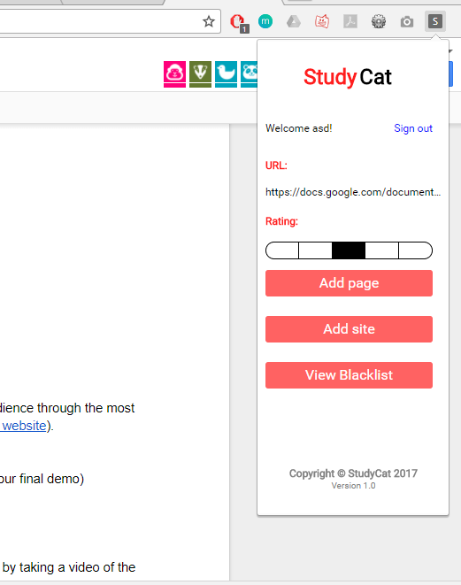

# Study Cat

## Iteration 2 - Review & Retrospect

When: Wednesday November 29
Where: Online via. Discord

## Process - Reflection

#### Decisions that turned out well

* Setting internal deadlines to get everything done well in advance, this fixed our procrastination issue of getting everything done just before the deadline. Also, this made sure we aren't pushing broken code for the next team to use and gave us a "grace period" in case something suddenly stopped working.
* Starting work for this deliverable to be complete well in advance.
* Setting good communication standards before and after code is committed to the repository, this fixed our problem from last time where communication between teams was the main problem in finishing things late.  
* Started work on android app. 
* Deciding to take one or two days off this project to fully rest and deliver on time with effeciency. 

  
  

[Link to some of our team notes.](https://drive.google.com/drive/folders/0B2HiDj_0mhzYZktXVWxpaUdUZW8)

#### Decisions that did not turn out as well as hoped

* Some internal deadlines were not hit by everyone, as such we should have been more realistic in setting these deadlines
* A lot more unexpected bugs were encountered this time than before, which delayed progress in our overall process 
* Some code could have been better structured. (For the chrome extension)
* Did not have the time to test out both chrome extension and desktop app synchronously.

#### Planned Changes

In order to show a complete working product in the given time span for the demo, we believe the following would be realistic changes to have:
* UI improvements
    - Visuals of the desktop application could still use some improvements
    - A few UI bugs on chrome extension that need be fixed.
* Test Android, Chrome extension and Desktop to see if they work synchronously with each other. Check if data is maintained accross all three devices. Debug if necessary. 
 
## Product - Review

#### Goals and/or tasks that were met/completed:

Art:
* Received artist assets and integrated them into our UI.
* Centralized the color schemes of our chrome extension, desktop app, and android app.

Server: 

* Implement transfer of chrome extension, android app, and desktop app data.
* Modified method of data transfer to encapsulate each application's white list of processes. Server now only transfers your level of productivity rather than the processes you run.

Front End:
* Fully asynchronous server requests. App won't freeze during login, registration, pushes to the server, and updates.
* Implemented system of callbacks to handle the responses from the http requests.
* Dynamic login responses, telling the user whether their login was successful, and if it wasn't, tells them the reason for failure.
* Fully integrated data from chrome extension, android app, and desktop app, all of which is now used to monitor productivity.

Android App:
* Created fully functioning android app which interfaces with the server and the desktop app for on the go updates on your productivity level.

Chrome extension: 
* Fully developed front end which is now compatible with back end. 
* Slightly altered data sent to server from monitoring tabs due to a miscommunication earlier.
* Simplified server code a bit so its more effecient when communicating with the extension.
* Fixed numerous UI and functionality bugs which were unnoticed in the last iteration. 

 

 

#### Goals and/or tasks that were planned but not met/completed:

* Having the User's data persist across devices
    - Synchronizing data between devices hasn't been implemented yet
    - The team determined that getting the main functionality as polished as possible was a higher priority than extra details such as multi device support
* Multi-platform support (OSX and W10)
    - Currently the process monitoring will only work for devices using Windows as we installed the win32 packages instead of the Unix based packages
    - We plan on creating an interface which will allow the app to dynamically choose which packages to use for process monitoring. 

## Meeting Highlights

* For our next iteration we are planning on implementing the goals that we planned earlier but were not able to complete such as user data persistence, and multi-platform support. We believe that these are important features that should be implemeneted for our MVP, which we explain above.
* For the MVP we also want to have group functionality implemented, as this was one of the key unique features of our app.
* We also plan on adding some smaller features such as being able to customize appearance of the cat/user and adding custom user-defined productivity levels (being able create our own productivity categories).

